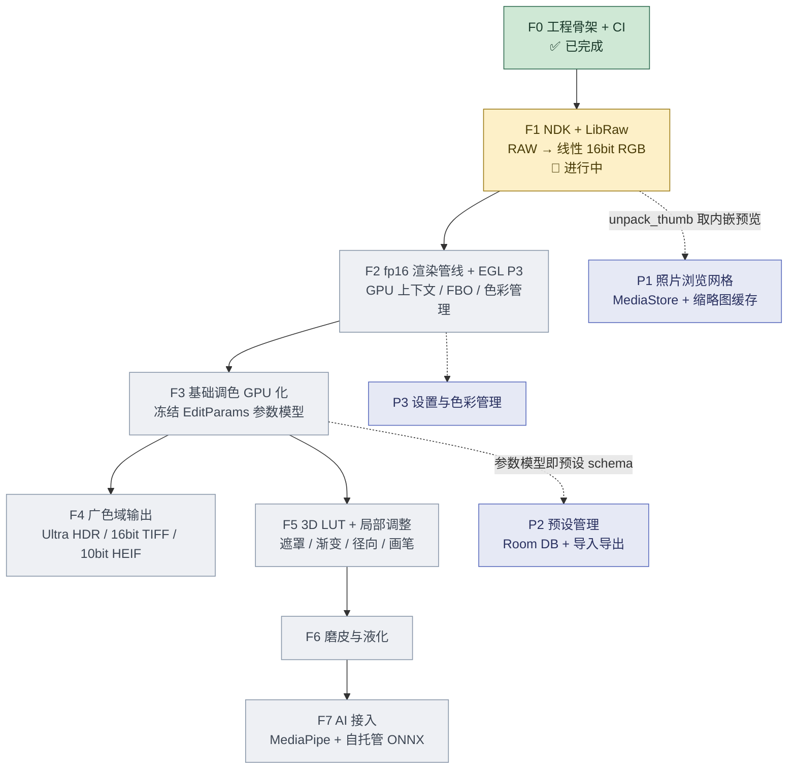

# PixelCake Android — 开发计划

> 本文档是**断点续做的唯一主入口**。
> 换机器、换模型、换 Agent 工具后，先读完本文件与 `code_explain.md`，再动手改代码。
>
> - 仓库：<https://github.com/hifn123p/pixel-cake-android>（public，分支 `main`）
> - 配套文档：`code_explain.md`（代码结构与调用链）、`README.md`（构建/取包/CI）
> - 最后更新：2026-09-04

---

## 0. 三十秒速览

| | |
| --- | --- |
| 是什么 | 给 **Sony A7C2** 用的**本地离线** RAW 调色 App，Android 原生 |
| 目标机 | 一加 15 / ColorOS 16（Android 16，API 36），骁龙 8 Elite Gen 5 / Adreno 840 |
| 技术栈 | Kotlin + Jetpack Compose + Material 3 + **GLES 3.0** + **NDK/LibRaw** |
| 当前状态 | 第 1 步（工程骨架 + CI）**已合入且 CI 全绿**；第 2 步（NDK + LibRaw）**代码写了一部分，尚未提交、尚未编译验证** |
| 立即要做 | 补完第 2 步剩余 5 个文件 + 改 `build.gradle.kts` + 改 CI 拉 submodule，推到 CI 全绿。详见 §7 |

---

## 1. 项目定位与边界

### 1.1 要做什么

把桌面端 [pixel-cake](https://github.com/hifn123p/pixel-cake)（Rust + Tauri）的思路搬到手机：
导入 A7C2 的 14bit ARW → 自己的解码与色彩管线 → 调色 → 导出广色域成片。

### 1.2 明确的边界（不要越界）

| 边界 | 说明 |
| --- | --- |
| **纯本地** | 不联网、不上传、无账号体系。AI 模型自托管在 APK 内或首次启动时下载到本地 |
| **桌面端仅供参考** | 不复用其 Rust 实现。App 侧可以选更合适的算法 |
| **不追求相机品牌全覆盖** | 以 A7C2（ILCE-7CM2，33MP，14bit ARW）为唯一首要目标；LibRaw 顺带支持的机器能跑就算赚的 |
| **不做 Material You 动态取色** | 取用户壁纸颜色会污染照片色彩判断 |

### 1.3 质量红线

用户明确要求 **RAW 处理要做到最好的效果和精度**。这不是"差不多就行"，具体含义：

- 解码全程保 **16bit 线性**（不要在中途降到 8bit）
- 中间缓冲用 **fp16 / fp32**，不用 8bit 整数
- 输出支持 **Display P3** 广色域，不是只有 sRGB
- 预览降采样、导出全分辨率，但**两者必须共用同一套着色器**，杜绝"预览好看、导出不一样"

---

## 2. 当前进度快照

### 2.1 已合入 main（可编译、可运行）

| 阶段 | 内容 | commit | 验证 |
| --- | --- | --- | --- |
| 1 | 工程骨架 + GitHub Actions CI | `e7e18d0`（以及 `175e8fc`/`88b8f31`/`6659dfd`/`629d6c4`） | Actions run #5 全绿；Debug APK 26.4 MB；用户已装机实测 |

**阶段 1 交付的具体内容**

- Gradle 版本目录（`gradle/libs.versions.toml`）+ AGP 8.13.2 / Kotlin 2.2.21 / Compose BOM 2025.11.01
- `app/build.gradle.kts`：签名配置按环境变量有无动态创建（缺 Secret 时回退 debug 签名）
- CI 四个 job：`build` / `lint` / `check-signing` / `release`
- `MainActivity` + `HomeScreen`：**设备能力实测面板**（不是 Hello World）
- `DeviceCapabilities.kt`：广色域、HDR 类型、刷新率、内存预算核算
- `PixelCakeApp`、`Theme/Color/Type`、启动器图标、备份规则

**真机实测基线（一加 15，用户已确认）**

| 项 | 实测值 | 结论 |
| --- | --- | --- |
| 广色域（Display P3） | **支持** | Display P3 管线成立 |
| HDR | **HDR10+** | Ultra HDR（gainmap）输出可用 |
| 全分辨率 fp16 可行性 | **可行** | 33MP × RGBA16F 三缓冲约 749 MiB，可用内存足够 |
| 主 ABI | arm64-v8a | 只需编译 arm64，省一半构建时间 |

> 这三条是后面所有渲染决策的实测依据。**不要凭推理推翻它们。**

### 2.2 已写但未提交（阶段 2 进行中，⚠️ 从未编译过）

这些文件目前只存在于工作区 / 暂存区，**没有经过一次 CI 验证**，接手时当作"待调试代码"看待：

| 文件 | 状态 | 说明 |
| --- | --- | --- |
| `.gitmodules` | 已 `git add` | 声明 `third_party/libraw` → LibRaw/LibRaw.git |
| `third_party/libraw` | 已 `git add`（gitlink @ `b93f6e45`） | LibRaw **0.22.2** 的 gitlink；工作区尚未 init |
| `app/src/main/cpp/CMakeLists.txt` | 未 track | 顶层 CMake：定位 LibRaw、链接 `pixelcake_raw` |
| `app/src/main/cpp/libraw/CMakeLists.txt` | 未 track | 按官方 `Makefile.dist` 的 79 个目标组织源文件，编成 `libraw_static` |
| `app/src/main/cpp/raw_bridge.cpp` | 未 track | JNI 桥接：open / info / 内嵌预览 / 完整解码+降采样 |
| `app/src/main/java/.../raw/RawInfo.kt` | 未 track | 元数据 data class + 扁平数组解码器 |

### 2.3 阶段 2 尚未开始的部分

**缺这 6 项，第 2 步就跑不起来**（详细伪代码见 `code_explain.md` §5）：

1. `raw/RawNative.kt` —— `external` 声明 + `System.loadLibrary`
2. `raw/RawImage.kt` —— 句柄封装（`Closeable`）、持有 ByteBuffer 保活
3. `raw/RawDispatcher.kt` —— 单线程调度器（LibRaw 实例非线程安全）
4. `ui/raw/RawDecodeViewModel.kt` + `RawDecodeScreen.kt` —— SAF 选文件 + 元数据展示 + 两档渲染
5. `app/build.gradle.kts` —— `externalNativeBuild { cmake {} }` + `ndk { abiFilters }` + `ndkVersion`
6. `.github/workflows/android.yml` —— checkout 必须 `submodules: recursive`，否则 CMake 报"找不到 LibRaw 源码"

---

## 3. 功能开发逻辑关系

### 3.1 主干依赖 DAG



### 3.2 依赖关系的三个关键点

**① 主干是严格串行的，跨不过去。**
F2 需要 F1 吐出的**线性 16bit** 数据；F3 需要 F2 的 GPU 上下文与纹理；F4/F5 需要 F3 的参数模型。
试图先做 UI 再做管线会返工——参数模型没冻结之前，UI 绑什么？

**② `EditParams`（调色参数模型）是整个项目的中枢契约。**
它在 F3 定义，但被 F4（导出时要序列化进 XMP/ sidecar）、F5（LUT 前后顺序）、P2（预设就是它的一个快照）同时依赖。
**建议：F3 动手前先把 `EditParams` 的字段与顺序冻结并写进 `code_explain.md`，之后只增不改。**

**③ P1 / P2 / P3 是可以并行的支线，不阻塞主干。**
- P1（照片浏览）只需 F1 的 `unpack_thumb()`，可以在等 F3 的时候做
- P2（预设管理）依赖 F3 的参数 schema，schema 一冻结就能独立开发
- 推荐节奏：主干推进遇到阻塞时切支线，别空转

### 3.3 数据流（贯穿所有阶段）

```
SD 卡 / SAF Uri
   │  readAll → direct ByteBuffer（33 MB 级）
   ▼
LibRaw.open_buffer()          ← F1
   │  open / unpack / dcraw_process
   ▼
线性 16bit RGB（ushort，33MP ≈ 196 MB）   ← F1 产出
   │  上传为 RGBA16F 纹理                  ← F2
   ▼
GPU 着色器链（同一份 GLSL，预览/导出共用）  ← F3/F5/F6
   │  预览：降采样纹理 → 屏幕 P3 FBO
   │  导出：全分辨率 FBO → 编码
   ▼
Ultra HDR JPEG / 16bit TIFF / 10bit HEIF  ← F4
```

---

## 4. 分阶段计划

### 阶段 2 — NDK + LibRaw（A7C2 ARW 解码）🔧 进行中

**目标**：LibRaw 0.22.2 在 arm64 上编译通过，能打开 A7C2 的 ARW 并读出正确元数据与一张能看的图。

**交付物**
- `third_party/libraw` submodule（0.22.2）
- 两套 CMakeLists + `raw_bridge.cpp`
- Kotlin 侧 `RawNative` / `RawImage` / `RawDispatcher` / `RawInfo`
- `RawDecodeScreen`：SAF 选 ARW → 显示机身/尺寸/位深/白平衡/镜头参数 → 两档渲染（内嵌预览瞬时 / 完整解码带耗时）

**验收标准**
- [ ] CI `build` job 全绿（含 NDK 交叉编译 LibRaw 79 个源文件）
- [ ] 真机上 `librawVersion()` 返回 `0.22.2-Release`
- [ ] 打开一张 A7C2 的 ARW：`make = SONY`，`model = ILCE-7CM2`，`rawBps = 14`，`rawWidth = 7008`
- [ ] `unpackFunction` 非空且是 Sony 的解码器（不是 `unpack_generic`）
- [ ] 内嵌预览图能显示
- [ ] 完整解码能出图，且 UI 上显示出耗时

**依赖**：阶段 1

**主要风险与对策**

| 风险 | 对策 |
| --- | --- |
| CMake 找不到 LibRaw（CI 没拉 submodule） | CI checkout 必须加 `submodules: recursive`；CMake 里已写死"找不到就 FATAL_ERROR 并提示命令" |
| 79 个源文件清单与版本不符 | CMake 里硬校验数量，不等 79 直接构建失败并提示版本不对。**不要为了通过而删掉这个校验** |
| `user_qual` 没有公开枚举 | LibRaw 0.22 只有裸整数（0=线性 1=VNG 2=PPG **3=AHD** 4=DCB 11=DHT 12=AAHD），代码里已用 `kQualityAhd = 3` 加注释固化 |
| 单次解码峰值内存数百 MB | 预览默认 `half_size = 1`（8MP 级），并已接单线程调度器串行化 |

**已知取舍（后续可优化）**：目前 **OpenMP 关闭**（`LIBRAW_NOTHREADS`），单线程 AHD 在 33MP 上要数秒。
开启方式：把 `app/src/main/cpp/libraw/CMakeLists.txt` 里的 `PC_LIBRAW_OPENMP` 置 ON，并确认 AGP 会把 `libomp.so` 打进 APK；否则改用 `-static-openmp`。
ZLIB 同样默认关闭——只有浮点 DNG 的 deflate 解压需要，Sony ARW 用不到。

---

### 阶段 3 — fp16 渲染管线 + EGL P3

**目标**：把 LibRaw 的线性 16bit 数据搬上 GPU，建立 P3 广色域的 EGL 上下文，打通"上传纹理 → 跑着色器 → 读到结果"。

**交付物**
- `EglCore`（EGLContext / EGLSurface / 离屏 PBuffer）
- `GlProgram`（编译/链接/ uniform 绑定封装）
- `Rgba16Fbo`（`EXT_color_buffer_half_float` 检测 + FBO 管理）
- `RawTextureUploader`（16bit RGB → RGBA16F 纹理，含分块上传避免一次 196 MB）
- `ColorSpace` 转换矩阵（XYZ ↔ P3 ↔ sRGB）

**验收标准**
- [ ] 能创建 RGBA16F 离屏 FBO（一加 15 上 `EXT_color_buffer_half_float` 必须可用）
- [ ] 33MP 纹理上传不 OOM
- [ ] 恒等着色器（直通）的预览与导出像素逐字节一致
- [ ] 同一个 50% 灰输入，在 sRGB 与 P3 输出下的量化值不同（证明色域确实生效）

**依赖**：阶段 2

**风险**：Adreno 840 上 fp16 纹理的滤波（`GL_LINEAR`）支持情况要实测；`GL_EXT_color_buffer_half_float` 在部分驱动上只支持 renderbuffer 不支持 texture。

---

### 阶段 4 — 基础调色 GPU 化

**目标**：把常用调色参数做成 GPU 着色器，实时预览。

**参数模型 `EditParams`（⚠️ 先冻结 schema 再写实现）**

```
曝光 exposure / 对比度 contrast / 高光 highlights / 阴影 shadows
白色 whites / 黑色 blacks / 饱和度 saturation / 自然饱和度 vibrance
色温 temperature / 色调 tint
清晰度 clarity / 去雾 dehaze
锐化 sharpen / 降噪 denoise
暗角 vignette / 颗粒 grain
裁剪 crop / 旋转 rotation / 翻转 flip
```

**验收标准**
- [ ] 全参数实时（≥30fps @ 预览分辨率）
- [ ] 所有运算在线性光下进行，最后一步才做 gamma / 色域映射
- [ ] 参数极值不产生 NaN / 条带

**依赖**：阶段 3

---

### 阶段 5 — 广色域输出

- **Ultra HDR JPEG**（gainmap，API 34+）：SDR 底图 + gainmap，兼容不支持 HDR 的查看器
- **16bit TIFF**：无损归档
- **10bit HEIF**：体积与质量的折中
- 元数据：EXIF / XMP 写入（含调色参数回写，便于桌面端继续编辑）

**依赖**：阶段 3（导出走同一套着色器）

---

### 阶段 6 — 3D LUT 滤镜与局部调整

- 3D LUT：33³ 展开成 **1089×33 的 2D tile 纹理**，手写三线性插值（GLSL ES 没有 `sampler3D`）
- 局部调整：线性渐变 / 径向渐变 / 画笔遮罩，遮罩本身也是一张纹理
- LUT 强度、LUT 与基础参数的前后顺序要可配

**依赖**：阶段 3

---

### 阶段 7 — 磨皮与液化

- 高频分离 + 保边平滑（双边 / guided filter）
- 液化：网格变形 + GPU 重采样
- 需要皮肤区域遮罩 → 天然依赖阶段 8 的 AI 分割

**依赖**：阶段 6（遮罩基础设施）、阶段 8（皮肤/人脸遮罩）

---

### 阶段 8 — AI 接入

- **MediaPipe Tasks**（Apache 2.0，自带 `.task` 模型，无需 GMS）
- 自托管 ONNX（ONNX Runtime Mobile；备选阿里 MNN / 腾讯 NCNN）
- 用途：人像分割、人脸 landmark、天空替换、自动曝光建议

**为什么不用 ML Kit**：国行 ColorOS 没有 GMS，ML Kit 直接不可用。这是硬约束。

**依赖**：阶段 6（遮罩）

---

### 支线 P1 / P2 / P3

| 支线 | 内容 | 可开始于 |
| --- | --- | --- |
| P1 照片浏览网格 | MediaStore 查询 + `unpack_thumb` 缩略图 + 磁盘缓存 + 分页 | 阶段 2 完成后 |
| P2 预设管理 | Room DB 存 `EditParams` 快照 + JSON 导入导出 + 预设分组 | `EditParams` schema 冻结后 |
| P3 设置与色彩管理 | 导出格式/质量、色域偏好、缓存清理、日志 | 阶段 3 完成后 |

---

## 5. 不可摇摆的决策清单

**这些是反复论证过的结论，接手后不要重新讨论，直接执行。**
若确实有理由推翻，请先在同一份文档里写下新证据再改。

| # | 决策 | 为什么 |
| --- | --- | --- |
| 1 | minSdk 33 | 广色域 API 与 Compose 现代 API 的实用下限 |
| 2 | targetSdk / compileSdk **36** | 对齐 Android 16。**lint 的 `OldTargetApi` 警告是刻意的**，不要"顺手修掉" |
| 3 | AGP 停在 **8.13.2**（8.x 末版） | 避免未经适配的大版本跳跃。`AndroidGradlePluginVersion` 警告同样是刻意的 |
| 4 | **GLES 3.0，不用 AGSL** | AGSL 需 API 33+ 且**无法离屏渲染**——预览和导出没法共用同一份着色器，违背质量红线 |
| 5 | **RGBA16F** 中间缓冲 | 8bit 中间量会在暗部产生条带 |
| 6 | **LibRaw 0.22 源码编译** | 桌面端 vendored 的 0.20.1 相机表只到 A7M3 时代，**不支持 A7C2（ILCE-7CM2）** |
| 7 | **不用 ML Kit** | 国行无 GMS |
| 8 | **不做 Material You** | 动态取色污染色彩判断 |
| 9 | 预览降采样 + 导出全分辨率，但**共用着色器** | 唯一能杜绝"预览/导出不一致"的做法 |
| 10 | 3D LUT 用 **2D tile + 手写三线性插值** | GLSL ES 无 `sampler3D` |
| 11 | 只编 **arm64-v8a** | 一加 15 是 arm64，编全 ABI 白白翻倍构建时间 |

---

## 6. 环境约束与已知坑

### 6.1 开发环境

- **本机无 Android SDK / JDK**。所有代码推 GitHub，靠 Actions 编译。
  → **每一次试错约 3 分钟**（热缓存 build ~120s、lint ~190s）。
  → 因此：**提交前务必静态自检**（见 §6.4），别拿 CI 当语法检查器。

### 6.2 网络与推送方式（⚠️ 2026-09-04 已变更）

本机环境有 MITM 代理，其 CA 不在任何标准证书 bundle 里，且**代理地址会随会话变化**
（早期是 `127.0.0.1:10151`，现在是 `127.0.0.1:9971`）。更麻烦的是代理对 `github.com:443`
的 CONNECT **返回 502**，而对 `api.github.com` / `codeload.github.com` / `raw.githubusercontent.com` 正常。

实测通路：

| 目标 | 结果 |
| --- | --- |
| `https://github.com` | ❌ 000（代理 502） |
| `https://api.github.com` | ✅ 200 |
| `https://codeload.github.com` | ✅ 200 |
| `https://raw.githubusercontent.com` | ✅ 200 |
| `github.com:22`（SSH） | ✅ 握手可达 |

**结论：改用 SSH 推送，HTTPS 已不可用。** 因为 502 发生在 CONNECT 层，
给 PAT 也解决不了——传输层就过不去。

已完成的切换：

```bash
# ~/.ssh/config
Host github.com
    HostName github.com
    User git
    IdentityFile C:/Users/renhi/.ssh/id_ed25519_pixelcake
    IdentitiesOnly yes
    PreferredAuthentications publickey

# 仓库 remote
git remote set-url origin git@github.com:hifn123p/pixel-cake-android.git
```

- `git clone` 走 HTTPS 代理**必失败**（`OpenSSL SSL_read: unexpected eof`）；走 SSH 正常。
- `curl` 拉 `codeload.github.com` 的 tarball 可用（当初绕过 submodule 添加失败就是靠它）。
- 早期用过的 PAT **应当已吊销**；迁移后一律走 SSH。
- 若新机器也要推，把 `~/.ssh/id_ed25519_pixelcake`（私钥）与 `.pub` 一起带过去。

### 6.3 已经踩过的坑（不要重蹈）

| 坑 | 现象 | 结论 |
| --- | --- | --- |
| `secrets` 写在 job 级 `if` | run 瞬间失败、`total_count: 0`、日志 404 | GitHub 解析期就判整个 workflow 非法。必须用一个探测 job 把 secret 转成 output |
| `IntArray?.orEmpty()` | `Unresolved reference` | `orEmpty()` 只对 `Array`/`List`/`String`/`Map` 有定义，**基本类型数组不适用**。用 `?.map { } ?: emptyList()` |
| 备份规则里的 `<exclude>` | 3 个 `FullBackupContent` error | 一旦有 `<include>`，未列出的 domain 默认即不备份，**不能再 exclude** |
| `gradlew` 带 CRLF | Linux runner `/bin/sh^M: bad interpreter` | 已用 `.gitattributes` 强制 LF |
| XML 注释插在标签属性之间 | not well-formed | 提交前用 `xml.etree.ElementTree.parse` 静态校验 |
| `import` 放在 `plugins {}` 之后 | KTS 编译失败 | Kotlin 语法要求 import 在所有声明之前 |

### 6.4 提交前静态自检清单

因为本机编译不了，这几项必须在本地用脚本查：

1. **XML 合法性**：所有 `res/**/*.xml`、`AndroidManifest.xml` 过一遍 `ElementTree.parse`
2. **Kotlin/Gradle 括号配平**：大括号数量、`{` 与 `}` 是否成对（尤其 `Edit` 工具改过的文件——历史上发生过吞掉 `buildFeatures {` 一行）
3. **JNI 方法名 ↔ Kotlin `external` 声明**：逐字比对 `Java_com_hifn_pixelcake_raw_RawNative_xxx` 与 Kotlin 里的函数名
4. **改完立即 `git diff` 复读**，不要凭记忆认为改对了

### 6.5 仓库状态提醒

- 仓库当前是 **public**。若不打算开源，改私有。
- 签名 Secrets（`KEYSTORE_BASE64` / `KEYSTORE_PASSWORD` / `KEY_ALIAS` / `KEY_PASSWORD`）未配置 → `release` job 一直 skipped，属正常。
- Debug APK 产物保留 14 天，注意及时下载。

---

## 7. 断点续做清单（按顺序做）

阶段 2 收尾。按这个顺序做，每步都能独立验证：

- [ ] **1.** 补 `raw/RawNative.kt`（`external` 声明 + `init { System.loadLibrary("pixelcake_raw") }`）
- [ ] **2.** 补 `raw/RawImage.kt`（句柄 `Closeable` 封装；持有 direct ByteBuffer 保活）
- [ ] **3.** 补 `raw/RawDispatcher.kt`（单线程调度器）
- [ ] **4.** 改 `PixelCakeApp.kt`：在 `onCreate` 里 `System.loadLibrary("pixelcake_raw")`
- [ ] **5.** 改 `app/build.gradle.kts`：
      - `ndkVersion = "27.2.12479018"`
      - `defaultConfig { ndk { abiFilters += "arm64-v8a" } }`
      - `externalNativeBuild { cmake { path = file("src/main/cpp/CMakeLists.txt"); version = "3.22.1" } }`
      - 依赖加 `androidx-lifecycle-viewmodel-compose`（版本目录同步加）
- [ ] **6.** 补 `ui/raw/RawDecodeViewModel.kt` + `RawDecodeScreen.kt`
- [ ] **7.** 改 `MainActivity.kt`：加顶部 Tab（FilterChip）在「设备能力」与「RAW 解码」间切换；
      同时把 `HomeScreen` 自己的 `Scaffold/TopAppBar` 上提到 `MainActivity`，避免嵌套
- [ ] **8.** 改 `HomeScreen.kt`：路线图第 2 项文案改为「进行中」
- [ ] **9.** 改 `.github/workflows/android.yml`：**三个 job 的 checkout 都要加**
      ```yaml
      - uses: actions/checkout@v4
        with:
          submodules: recursive
      ```
      否则 CMake 会 FATAL_ERROR「找不到 LibRaw 源码」
- [ ] **10.** 本地静态自检（§6.4）后提交推送
- [ ] **11.** 看 CI：预期首次会因 NDK/CMake 细节失败 1～3 轮，**逐轮修到全绿**
- [ ] **12.** 下载 APK 装机，按 §4 阶段 2 的验收标准逐条打勾
- [ ] **13.** 更新 `README.md` 路线图与本文档 §2 的进度快照

---

## 8. 验收基线（真机实测，一加 15）

> 换机器 / 换设备后重跑一遍 `HomeScreen` 的设备能力面板，把结果回填这里。

| 项 | 期望 | 实测（2026-09-02，一加 15） |
| --- | --- | --- |
| 广色域 `isWideColorGamut` | true | ✅ true |
| HDR 类型 | 含 HDR10 或 HDR10+ | ✅ HDR10+ |
| 刷新率 | 60 / 120 Hz | 待回填 |
| 可用内存 | ≥ 1.5 GiB | 待回填 |
| fp16 三缓冲（33MP） | 749 MiB | — |
| 全分辨率可行 | true | ✅ true |
| 主 ABI | arm64-v8a | 待回填 |

---

## 9. 附：关键外部事实（已核实，可直接引用）

| 事实 | 值 |
| --- | --- |
| A7C2 内部型号 | `ILCE-7CM2`，7008×4672（33MP），14bit ARW |
| LibRaw 最新版 | **0.22.2**；gitlink `b93f6e45c194f5df9b02a43b1af9a54b4f41f33f` |
| LibRaw 许可 | **LGPL-2.1 OR CDDL-1.0**（双许可，非 GPL，可分发） |
| LibRaw 源文件 | `src/` 下 82 个 `.cpp`，`Makefile.dist` 的 `LIB_OBJECTS` 收录 **79** 个；差 3 个是 `*_ph.cpp` 占位空文件，必须排除 |
| LibRaw 是否需 libjpeg | **不需要**。`USE_JPEG` 只服务于 lossy DNG；缩略图 JPEG 字节直接交给 Android `BitmapFactory` |
| LibRaw `recycle()` | 会 **清空 `imgdata.idata / sizes / color / other / thumbnail`** 并回收 datastream → 调用后必须重新 `open_buffer` |
| `open_buffer()` | 内部会先 `recycle()`，所以**可重复调用**来回到干净状态 |
| 16bit 输出字节序 | **原生字节序**（`copy_mem_image` 直接按 `ushort*` 写，不做字节交换） |
| 版本矩阵 | AGP 8.13.2 / Kotlin 2.2.21 / Compose BOM 2025.11.01 / Gradle 8.13 / JDK 17 |
